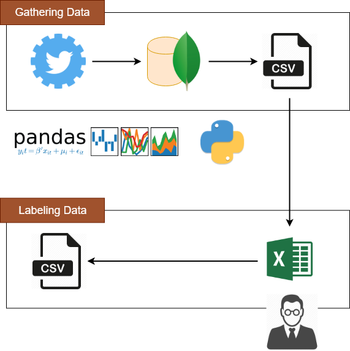
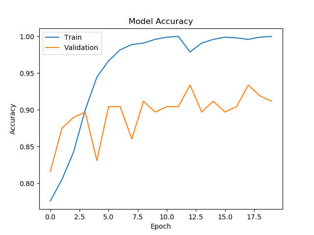
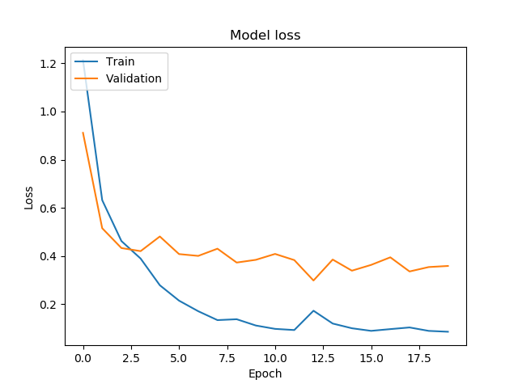
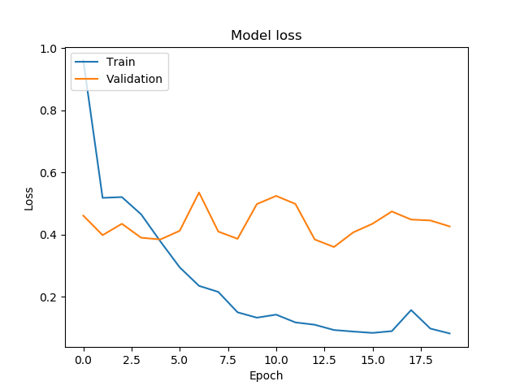
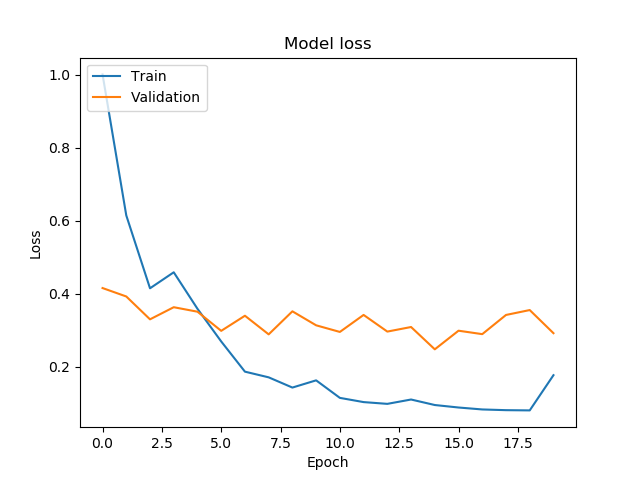
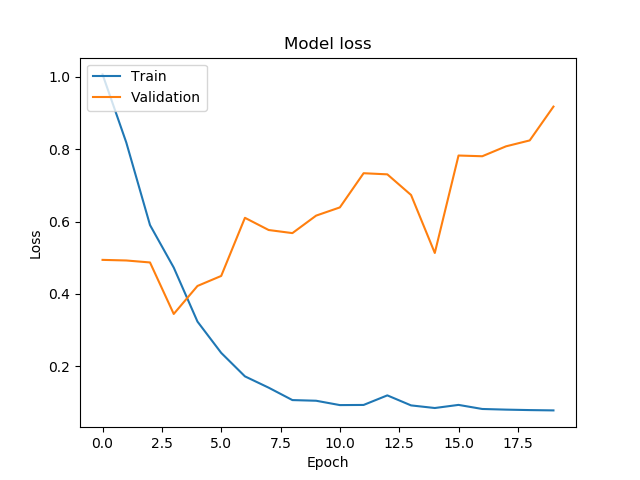
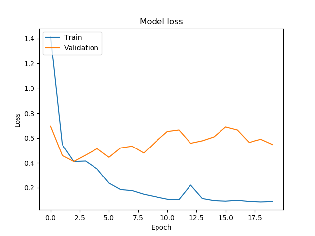

# Sinhalese Language based Hate Speech Detection

## Background

Advances in communication technology has brought people to one global position. Among them social media platforms play a major role with granting users freedom to speech by allowing them to freely express their thoughts, beliefs, and opinions. Children, adolescents, adults are spending significant amount of time on various social networking sites to connect with others, to share information, and to pursue common interests. Although this make great opportunities such as learn from others, there are some challenges. Racism, trolling, being exposed to large amounts of offensive online contents are such examples. The rapid growth of race hate speech on social media seems to have big impact on society and goodwill of a country.

Social media is the collective of online communications channels dedicated to community-based input, interaction, content-sharing and collaboration and is a very popular way for people to express their opinions publicly. Forums, microblogging, social networking, social bookmarking, social curation, and wikis are some of different types of social media and “Facebook”, “Twitter”, “Google+”, “Wikipedia”, “LinkedIn”, “Reddit”, “Pinterest” are some examples of popular social media. While social media helps people with connecting each other, sharing knowledge regardless of location, education background, updating information around the world, it also enables the risk of people to being targeted or harassed via offensive language which may severely impact the community in general.

Sri Lanka had a same kind of problem related to social medias in March, 2018 related to an incident happened in Digana, Kandy that occurs due to failure of social media to detect of race speeches and offensive language on comments and posts since they were in Sinhala language. Current tools failed to detect such things and the temporary solution was blocking on Facebook and other social media

## Objectives of the Research

In this research I am expecting to address two main tasks as our objectives. Those are mentioned below.

- To address the actual need of detecting hate speech in Sinhala language-based posts, introducing a labelled data set of Sinhala posts for future researches with the help of Sinhala language experts.
- Introduce a Deep Learning - Recurrent Neural Network architecture and pre-processing methods with the implementation. The implementation is done to be easy to understand and with the intention is to make it use in future researches for hate speech detection on Sinhala Language.

## Table of Content

- [1. Data-set](#1-data-set)
  - [1.1. Data-set](#11-data-labelling)
- [2. Pre-Processing](#2-pre-processing)
  - [2.1 Sinhala Language](#21-sinhala-language)
  - [2.2. Fixing Vowels](#22-fixing-vowels)
  - [2.3. Simplifying Sinhalese Characters](#23-simplifying-sinhalese-characters)
- [3. Model](#3-model)
- [4. Run the Model - Local Setup](#4-run-the-model-local-setup)
  - [4.1. Requirements to Run the Code Setup](#41-requirements-to-run-the-code-setup)
  - [4.2. Training the Model](#42-training-the-model)
  - [4.3. Build Results](#43-build-results)
- [5. Run the Model - Google Colaboratory Setup](#5-run-the-model-google-colaboratory-setup)
- [6. Testing and Results Analysis](#6-testing-and-results-analysis)
  - [6.1. Experimental Setting](#61-experimental-setting)
  - [6.2. Accuracy and Loss of Folds](#62-accuracy-and-loss-of-folds)
  - [6.3. Confusion Matrices and Results](#63-confusion-matrices-and-results)
- [7. Extending the Data-Set](#7-extending-the-data-set)
  - [7.1. Requirements](#71-requirements)
  - [7.2. Run the Mongo DB](#72-run-the-mongo-db)
  - [7.3. Setup Twitter Keys](#73-setup-twitter-keys)
  - [7.4. Setup Twitter Search Query](#74-setup-twitter-search-query)
  - [7.5. Query with Tweeter](#75-query-with-tweeter)
  - [7.6. Create CSV from Mongo DB](#77-create-csv-from-mongo-db)
  - [7.7. Backup Mongo DB](#77-backup-mongo-db)

## 1. Data-Set

Data collection is done by with using both Twitter Standard  and Premium  search APIs. Tweets were searched with pre-identified key words collected via surveys and experts.

|    Class      |    Tweets Count    |
|---------------|-------------------:|
|    Neutral    |            1081    |
|    Racist     |             108    |
|    Sexism     |             222    |
|    **Total**  |          **1411**  |


### 1.1. Data Labelling

Following figure represents the process of data gathering and data labelling. The tweets found imported to Excel which interface with experts (graduates of Department of Political Science, Faculty of Social Science, University of Kelaniya, **K A D Thusitha Pradeep** and **D M M Ruwan Kumara**) to label them.



## 2. Pre-Processing

### 2.1. Sinhala Language

Sinhala language is used by more than 16 million native speakers and constitutionally recognized as the main official language of Sri Lanka and used by over 19 million people. It has developed into its current form over a long period of time with influences from a wide variety of languages including Tamil, Portuguese and English. It belongs to the Indo-Aryan branch of the Indo-European languages. The Sinhala alphabet consists of 61 letters comprising 18 vowels, 41 consonants and 2 semi-consonants.

|    Type               |    Letters                                                                                                                       |
|-----------------------|----------------------------------------------------------------------------------------------------------------------------------|
|    Vowels             |    අ, ආ, ඇ, ඈ, ඉ, ඊ, උ, ඌ, ඍ, ඎ, ඏ, ඐ එ, ඒ, ඓ, ඔ, ඕ, ඖ                                                                           |
|    Consonants         |    ක, ඛ,  ග, ඝ, ඞ, ඟ, ච, ඡ, ජ, ඣ, ඤ, ඥ, ඦ, ට, ඨ, ඩ, ඪ, ණ, ඬ, ත, ථ, ද, ධ, න, ඳ, ප, ඵ, බ, භ, ම, ඹ, ය, ර, ල, ව, ශ, ෂ, ස, හ, ළ, ෆ    |
|    Semi-Consonants    |    ං, ඃ                                                                                                                          |

### 2.2. Fixing Vowels

When typing Sinhala letters people can make mistakes. For example, “කෛ” can typed as “ක” + “ෙ” + “ෙ”. Following table shows two different ways writing the word “දෛවය”. Even though these two words seems same computer identify these two words as two different word.

|                    |    Letter Combination             |    Word     |
|--------------------|-----------------------------------|-------------|
|    Wrong Word      |    “ද” + “ෙ” + “ෙ” + “ව” + “ය”    |    දෙෙවය    |
|    Correct Word    |    “ද” + “ෛ” + “ව” + “ය”          |    දෛවය     |

Following python code snippest shows the different of these two words.

```py
wrong_text = "ද" + "ෙ" + "ෙ" + "ව" + "ය"
correct_text = "ද" + "ෛ" + "ව" + "ය"
print("wrong_text: " + wrong_text)
print("correct_text: " + correct_text)
print("wrong_text == correct_text: + str(wrong_text == correct_text))
```

Output of the above python code.

```sh
wrong_text: දෙෙවය
correct_text: දෛවය
wrong_text == correct_text: False
```

The following images shows different keys for "ෙ" and "ෛ".


The python implementation of vowel fixing can be found [here]( sinhala-preprocessing/python/preprocessing/sinhalese_vowel_letter_fixer.py).

### 2.3. Simplifying Sinhalese Characters

The textual contents in social networks are often informal, unstructured and even misspelled. With simplifying characters, it is able to identify same word with different misspelled words.

The tweet in following figure has the word “මූහූදට” instead of “මුහුදට”. The word “මෙ” can be spelled as “මේ”.

```sh
"@indika27 @P0dda මිනිස්සු කුණු දාන්නේ මූහූදට නෙ.,.... ඒකයි මෙ ඔක්කොම case. Sighhhhhhhh 😢"
```

The following python code snippest used to simplify all text for training purpose. This will allow computer to identify such words like “මූහූදට” and “මුහුදට” as same.

```py
simplify_characters_dict = {
    # Consonant
    "ඛ": "ක",
    "ඝ": "ග",
    "ඟ": "ග",
    "ඡ": "ච",
    "ඣ": "ජ",
    "ඦ": "ජ",
    "ඤ": "ඥ",
    "ඨ": "ට",
    "ඪ": "ඩ",
    "ණ": "න",
    "ඳ": "ද",
    "ඵ": "ප",
    "භ": "බ",
    "ඹ": "බ",
    "ශ": "ෂ",
    "ළ": "ල",

    # Vowels
    "ආ": "අ",
    "ඈ": "ඇ",
    "ඊ": "ඉ",
    "ඌ": "උ",
    "ඒ": "එ",
    "ඕ": "ඔ",

    "ා": "",
    "ෑ": "ැ",
    "ී": "ි",
    "ූ": "ු",
    "ේ": "ෙ",
    "ෝ": "ො",
    "ෲ": "ෘ"
}


def get_simplified_character(character: str) -> str:
    if len(character) != 1:
        raise TypeError("character should be a string with length 1")
    try:
        return simplify_characters_dict[character]
    except KeyError:
        return character


def simplify_sinhalese_text(text: str) -> str:
    """
    simplify
    :param text:
    :return:
    """
    modified_text = ""
    for c in text:
        modified_text += get_simplified_character(c)
    return modified_text

```

Example of simplification.

```py
print(simplify_sinhalese_text("@indika27 @P0dda මිනිස්සු කුණු දාන්නේ මූහූදට නෙ.,.... ඒකයි මෙ ඔක්කොම case. Sighhhhhhhh 😢"))
```

Output

```sh
"@indika27 @P0dda මිනිස්සු කුනු දන්නෙ මුහුදට නෙ.,.... එකයි මෙ ඔක්කොම case. Sighhhhhhhh 😢"
```

## 3. Model


This model also uses features, **“users' tendency towards racism or sexism”** (Pitsilis, G. K., Ramampiaro, H., & Langseth, H. (n.d.). Detecting Offensive Language in Tweets Using Deep Learning, 18.)

Model is implemented using [Keras](https://github.com/keras-team/keras/).
[](https://github.com/keras-team/keras/)

## 4. Run the Model - Local Setup

### 4.1. Requirements to Run the Code Setup

- [Python 3](https://www.python.org/download/releases/3.0/)
- [TensorFlow](https://github.com/tensorflow/tensorflow)
- [Keras](https://github.com/keras-team/keras)
- Pandas - `pip install pandas`
- Requests Oauthlib - `pip install requests_oauthlib`
- Emoji - `pip install emoji`

### 4.2. Training the Model

Run the following script to train the model. This will start training the model. Make sure the final CSV file has been placed as `[root directory]/data-set/final-data-set.csv`.

```bash
cd classifier/python/classifier; python classify.py
```

This will create an h5 file that contains the model in a directory `[root directory]/classifier/python/classifier/results_x`.

### 4.3. Build Results

Run the following script to validate the model. This will use the final results directory to validate the model, create files associate with scores in the same directory.

```bash
cd classifier/python/classifier; python validate.py
```

## 5. Run the Model - Google Colaboratory Setup


Without any settings defind in the section [4. Run the Model - Local Setup](#4-run-the-model-local-setup), you can run the model in Google Colaboratory and store the results in Google Drive. The python code in the jupyter note book will create a directory `sinhala_racism_detection` and will interact only with that directory (I make sure the python script will not read or write to any other directory of your Goole Drive. You can also review the script).

1. Copy [jupyter_notebook/sinhala_racism_detection.ipynb](jupyter_notebook/sinhala_racism_detection.ipynb) file into your Google Drive and open it with Google Colaboratory. Run the file and authorize it to save results to your drive.

1. Copy [jupyter_notebook/sinhala-racism-validation.ipynb](jupyter_notebook/sinhala-racism-validation.ipynb) and run the file in Google Colaboratory.

1. Find your results in the directory `sinhala_racism_detection` in your drive.

## 6. Testing and Results Analysis

### 6.1. Experimental Setting

I have performed five-fold cross validation and calculated the Precision, Recall and F1–Score. Each training fold was split into 88% training and 12% validation, while performance is evaluated over the remaining fold of unseen data. Following diagrams represent the distribution of tweets count among training, validation and testing for a fold.


|    Class      |    Total Tweets Count    |    Training Tweets Count    |    Validation Tweets Count    |    Testing Tweets Count    |
|---------------|--------------------------|-----------------------------|-------------------------------|----------------------------|
|    Neutral    |    1081                  |    757                      |    107                        |    217                     |
|    Racist     |    108                   |    80                       |    6                          |    22                      |
|    Sexism     |    222                   |    154                      |    23                         |    45                      |
|    Total      |    1411                  |    991                      |    136                        |    284                     |

### 6.2. Accuracy and Loss of Folds

|    Fold    |    Accuracy                                                                           |    Loss                                                                      |
|------------|---------------------------------------------------------------------------------------|------------------------------------------------------------------------------|
| 0          |   |  |
| 1          |   |  |
| 2          |   |  |
| 3          |   |  |
| 4          |   |  |

### 6.3. Confusion Matrices and Results

The following table represents the confusion matrices of each fold.

|    Fold    |    Confusion Matrix                                                       |
|------------|---------------------------------------------------------------------------|
|    0       |  |
|    1       |  |
|    2       |  |
|    3       |  |
|    4       |  |

The following table represents precision, recall and F1 score according to the confusion matrix of each fold of the model.

|    Fold    |    Class      |    Precision    |    Recall    |    F1 score    |
|------------|---------------|-----------------|--------------|----------------|
| 0          |    Neutral    |    0.9422       |    0.9770    |    0.9593      |
|            |    Racist     |    0.9444       |    0.7727    |    0.8500      |
|            |    Sexism     |    0.8537       |    0.7778    |    0.8140      |
| 1          |    Neutral    |    0.9461       |    0.8935    |    0.9190      |
|            |    Racist     |    0.6800       |    0.7727    |    0.7234      |
|            |    Sexism     |    0.6481       |    0.7778    |    0.7071      |
| 2          |    Neutral    |    0.8866       |    0.9769    |    0.9296      |
|            |    Racist     |    0.8333       |    0.6818    |    0.7500      |
|            |    Sexism     |    0.8077       |    0.4773    |    0.6000      |
| 3          |    Neutral    |    0.9352       |    0.9352    |    0.9352      |
|            |    Racist     |    0.6400       |    0.7619    |    0.6957      |
|            |    Sexism     |    0.7250       |    0.6591    |    0.6905      |
| 4          |    Neutral    |    0.8908       |    0.9444    |    0.9168      |
|            |    Racist     |    1.0000       |    0.5714    |    0.7272      |
|            |    Sexism     |    0.7000       |    0.6364    |    0.6667      |

Final F1 score for each class was calculated as getting average values of F1 scores of each fold and final F1 score value derived as the weighted mean of the separate F1 scores.
$F=(F_N|N|+F_R|R|+F_S|S|)/(|N|+|R|+|S|)$ where $|N|=1081, |R|=108$ and $|S|=222$ are tweets count of classes Neutral, Racist and Sexism. Following table represents calculated overall F1 score.

| Class   | F1 score     |
|---------|--------------|
| Neutral | $F_N=0.9320$ |
| Racist  | $F_R=0.7493$ |
| Sexism  | $F_S=0.6957$ |
| Overall |  $F=0.8808$  |

## 7. Extending the Data-Set

### 7.1. Requirements

- [Mongo DB](https://github.com/mongodb/mongo)
- Pymongo - `pip install pymongo`

### 7.2. Run the Mongo DB

Run the Mongo DB with following script.

```bash
mongod --dbpath data-set/mongo-db
```
Restore the existing Mongo DB to your environment with running the following script. But this is optional.

```bash
mongorestore [root directory]/data-set/dump
```

### 7.3. Setup Twitter Keys

Update the configuration file `twitter-api-reader/python/config/twitter-keys.ini` with your Twitter API keys.

```ini
[twitter]
client_key = <your client key>
client_secret = <your client secret>
resource_owner_key = <your resource owner key>
resource_owner_secret = <your resource owner secret>
```

### 7.4. Setup Twitter Search Query

Update the configuration file `twitter-api-reader/python/config/reader-config.ini` with Mongo DB host, port, database name and the collection name.

```ini
[mongo]
host = localhost
port = 27017
db = db
collection = tweets

[csv]
columns = id, user.id, created_at, text

[tweets]
query = බැගින් OR බැඟින් OR රකින්න OR නියමයි OR අදහස OR මුලු OR මුළු OR අධික OR පනින්න OR එයලව OR ආවාහම OR හට OR මෙන්
json_payload = {"query":"උන් OR උං OR සමහර OR අතරින් OR නැත්තම් OR මතකය","fromDate":"201803010000","toDate":"201805010000"}
```

- Use `[csv]` section to specify the columns that is used to create the csv file.
- Use `[tweets]` section to specify search query.
  - `query` is used for Standard Twitter Search API. Use `OR` to `AND` and other Tweeter operations to make query.
  - `json_payload` is used for Premium Twitter Search API. This is a JSON. You can specify `fromDate` and `toDate` to find Tweets in the range specified or any other operators that Tweeter API supports. Language may be an important operator.
    ```ini
    json_payload = {"query":"උන් lang:si OR උං lang:si OR සමහර lang:si","maxResults":"100","fromDate":"201811050000","toDate":"201812030000"}
    ```

### 7.5. Query with Tweeter

Words used to query is defined in the configurations done in the section [7.4. Setup Twitter Search Query](#74-setup-twitter-search-query). Run the following script to run the `tweets_to_mongo.py` file and query with standard Twitter API. Make sure you have an internet connection and have run the Mongo DB as in section [7.2. Run the Mongo DB](#72-run-the-mongo-db).

```bash
cd twitter-api-reader/python/twitter; python tweets_to_mongo.py s
```

To use the premium API change the letter `s` with `p30` or `pf` at the end of the script.

- `p30` - To retrieve Tweets within 30 days.
- `pf` - To retrive any Tweet (Full Archive).

example:

```bash
cd twitter-api-reader/python/twitter; python tweets_to_mongo.py p30
```

### 7.6. Create CSV from Mongo DB

You can create a CSV file from the specified Database and Collection in the configuration file mentioned in the section [7.4. Setup Twitter Search Query](#74-setup-twitter-search-query). Run the following script to create the CSV file.

```bash
cd twitter-api-reader/python/twitter; python mongo_to_csv.py
```

The created file can be found as `[root directory]/data-set/data-set.csv`. You can import this file to a spread sheet program and manually label tweets. The [**Excel file (xlsx)**](data-set/final-data-set.xlsx) used in this project can be found [here](data-set/final-data-set.xlsx). The exported CSV file from this program can be used for training the model.

Place the final CSV file as `[root directory]/data-set/final-data-set.csv`. This is used to train the model.

### 7.7. Backup Mongo DB

You can backup collected tweets by running following script.

```bash
mongodump --collection tweets --db db
```

## REFERENCES

- Badjatiya, P., Gupta, S., Gupta, M., & Varma, V. (2017). Deep Learning for Hate Speech Detection in Tweets. ArXiv:1706.00188 [Cs], 759–760. https://doi.org/10.1145/3041021.3054223
- Davidson, T., Warmsley, D., Macy, M., & Weber, I. (2017). Automated Hate Speech Detection and the Problem of Offensive Language. ArXiv:1703.04009 [Cs]. Retrieved from http://arxiv.org/abs/1703.04009
- fastText. (n.d.). Retrieved December 3, 2018, from https://research.fb.com/fasttext
- Gallege, S. (n.d.). NLP Analysis of Sinhala, 6.
- Gambäck, B., & Sikdar, U. K. (2017). Using Convolutional Neural Networks to Classify Hate-Speech (pp. 85–90). Association for Computational Linguistics. https://doi.org/10.18653/v1/W17-3013
- Hatebase.org Search Results for Language Sinhala. (n.d.). Retrieved December 1, 2018, from https://hatebase.org/search_results/language_id%3Dsin
- nltk.stem package — NLTK 3.4 documentation. (n.d.). Retrieved December 2, 2018, from https://www.nltk.org/api/nltk.stem.html
- Pitsilis, G. K., Ramampiaro, H., & Langseth, H. (n.d.). Detecting Offensive Language in Tweets Using Deep Learning, 18.
- Ruwandika, N. D. T., & Weerasinghe, D.-  A. R. (n.d.). Identification of Hate Speech in Social Media, 49.
- Temporary block on Facebook and other Social Media likely to be lifted - Sri Lanka Latest News. (n.d.). Retrieved January 19, 2019, from https://www.newsfirst.lk/2018/03/10/temporary-block-facebook-social-media-likely-lifted/
- Waseem, Z. (2016). Are You a Racist or Am I Seeing Things? Annotator Influence on Hate Speech Detection on Twitter. In Proceedings of the First Workshop on NLP and Computational Social Science (pp. 138–142). Austin, Texas: Association for Computational Linguistics. https://doi.org/10.18653/v1/W16-5618
- Waseem, Z., & Hovy, D. (2016). Hateful Symbols or Hateful People? Predictive Features for Hate Speech Detection on Twitter. In Proceedings of the NAACL Student Research Workshop (pp. 88–93). San Diego, California: Association for Computational Linguistics. https://doi.org/10.18653/v1/N16-2013
- Wickremesinhe, R., & Hattotuwa, S. (n.d.). A study of hate speech on Facebook surrounding Sri Lanka’s Parliamentary Election of 2015. Retrieved December 4, 2018, from https://www.cpalanka.org/wp-content/uploads/2016/03/Voting-in-Hate-1.pdf